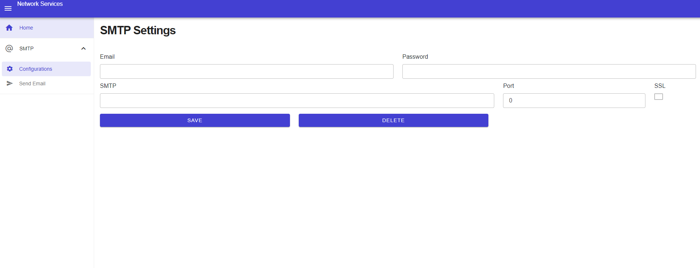
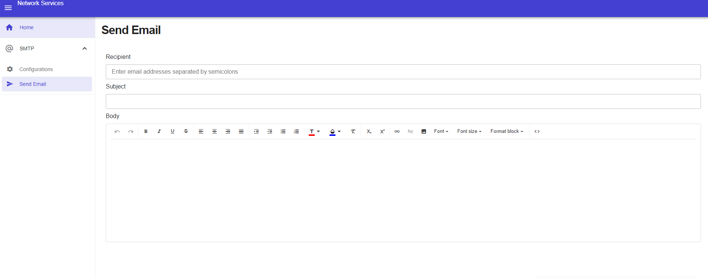
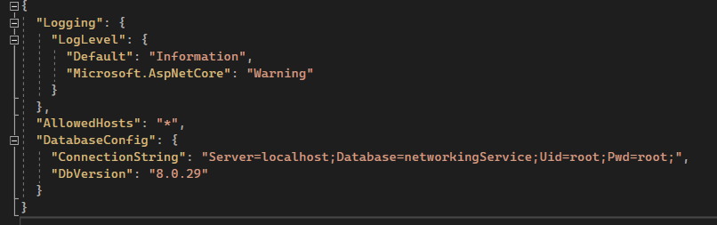

<h1 align="center">
  Network Services With Radzen Blazor and .NET 7
</h1>
This project have the objective to create a software with many network services, using Blazor Radzen in the front-end, .NET 7 with C# 11 in back-end, MySQL Server in the database and using Entity Framework for
mapping.
<h3> Current Available Services </h3>
<ul>
  <li>SMTP Service </li>
</ul>
  
<h2>
  SMTP Service
</h2>
To created the STMP Service was used the System.Net.Mail.SmtpClient. Need to be configured in the page STMP > Configurations.

  

When configurated, now you can send a email in the page STMP > Send Email.

  

To send for many email addresses is need separate with semicolons in the recipent textbox.
  
  <h2>
    Configure
  </h2>
  To configure the database is need to change the Connection String in the appsettings.json and the DbVersion to your respective database and version
  

    
  

 
  <h2>
    Depedencies
  </h2>
  <ul>
  <li> <a href="https://dotnet.microsoft.com/en-us/download/dotnet/7.0">.NET 7</a></li>
  <li><a href="https://www.mysql.com/downloads/">MySQL</a></li>
  </ul>
